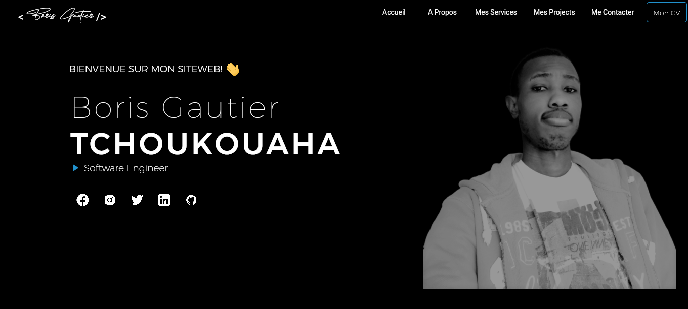

# MyWebsite

[](https://twitter.com/Boris_Gauty)
<br />
[](https://www.linkedin.com/in/boris-gautier-tchoukouaha-420262143/)



This Project contains the source code of my personal website developed with [Flutter](https://flutter.dev/) web.

## Getting Started

This project is a starting point for a Flutter application.

A few resources to get you started if this is your first Flutter project:

- [Lab: Write your first Flutter app](https://flutter.dev/docs/get-started/codelab)
- [Cookbook: Useful Flutter samples](https://flutter.dev/docs/cookbook)

For help getting started with Flutter, view our
[online documentation](https://flutter.dev/docs), which offers tutorials,
samples, guidance on mobile development, and a full API reference.

## Installation & Launch

Run

```sh
$ https://github.com/BorisGautier/MyWebsite.git
$ flutter pub get
$ flutter run
```

## Build

Run

```sh
$ flutter build web
```

## Packages

For this project I used the following plugins all available on [pub.dev](https://pub.dev/)

    - animated_text_kit
    - carousel_slider
    - cupertino_icons
    - google_fonts
    - responsive_builder
    - scrollable_positioned_list
    - universal_html
    - url_launcher
    - webview_flutter
